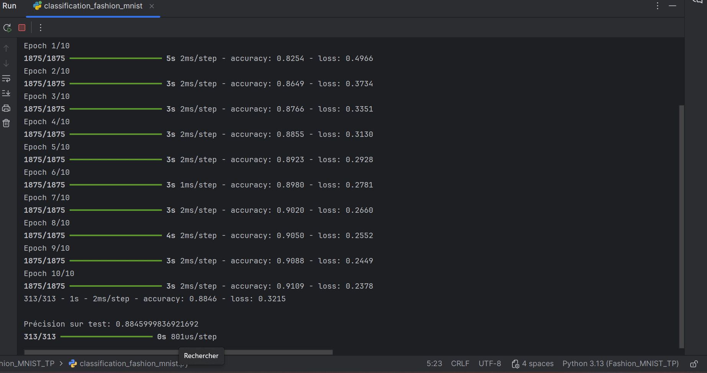

# 👕 Projet de Classification de Vêtements (Fashion MNIST)

Ce projet utilise un **réseau de neurones artificiels** avec **TensorFlow** et **Keras** pour **classer des images de vêtements** du jeu de données **Fashion MNIST**.

---

## 🚀 Objectif du Projet

Le but est de créer et d’entraîner un modèle capable de **reconnaître et classer différents types de vêtements**, tels que **T-shirts, pantalons, bottines**, à partir d’images en niveaux de gris.  
C’est un exemple classique de **classification d’images en deep learning**.

---

## 💾 Jeu de Données : Fashion MNIST

Le jeu de données contient **70 000 images** en niveaux de gris de **28×28 pixels**, réparties en **10 catégories**.

### Préparation des Données
- **Chargement** : séparation en **60 000 images d’entraînement** et **10 000 images de test**.  
- **Normalisation** : division des pixels par 255.0 pour obtenir des valeurs entre 0 et 1.

### Aperçu
Un exemple des **25 premières images du jeu d’entraînement** peut être affiché avec leurs étiquettes correspondantes.


---

## 🧠 Architecture du Modèle

Le modèle est un **réseau de neurones séquentiel** avec trois couches principales :

1. **Flatten** : transforme l’image 2D en un vecteur 1D de 784 pixels.  
2. **Dense de 128 neurones avec activation ReLU** : apprend les motifs caractéristiques des vêtements.  
3. **Dense de 10 neurones** : produit un score pour chacune des 10 classes.

### Compilation
- **Optimiseur** : `adam`  
- **Fonction de perte** : `SparseCategoricalCrossentropy`  
- **Métrique** : `accuracy`

---

## 📈 Entraînement et Performance

Le modèle est entraîné sur **10 époques**.  
La précision s’améliore et la perte diminue au fil des époques.

Après l’entraînement, le modèle est évalué sur le jeu de test et obtient une **précision d’environ 88,46 %**.




---

## 🔮 Prédictions et Visualisation

- Une **couche Softmax** est ajoutée pour convertir les scores en probabilités.  
- Les fonctions `plot_image` et `plot_value_array` permettent de visualiser les résultats :  
  - L’étiquette prédite est **bleue** si elle est correcte.  
  - L’étiquette prédite est **rouge** si elle est incorrecte.

---

## 🛠️ Exécution du Projet

### Installation des dépendances
```bash
pip install tensorflow numpy matplotlib
👩‍💻 Auteur
Salma SBA – Étudiante en ingénierie informatique passionnée par le Deep Learning et le développement full-stack.
